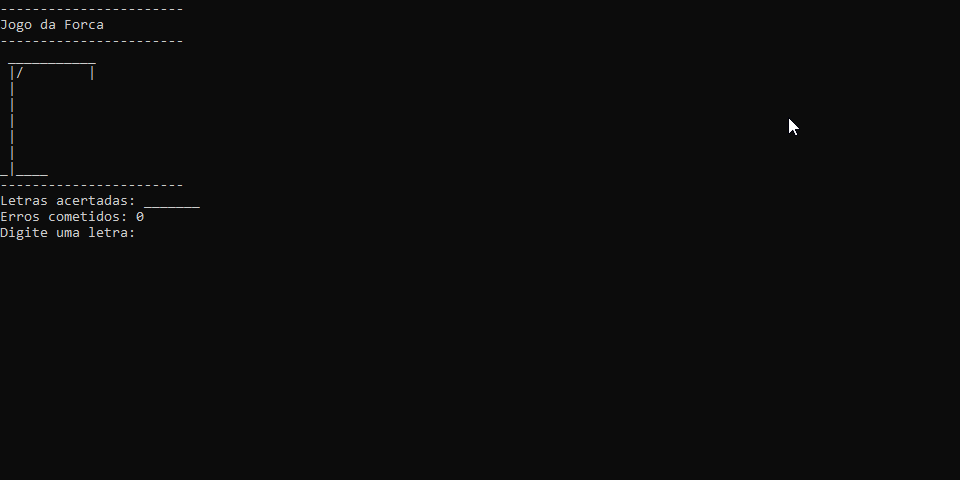

# Jogo da Forca



## Projeto

Desenvolvido durante o curso Fullstack da [Academia do Programador](https://www.academiadoprogramador.net) 2026

## Introdução

O computador escolherá, de maneira aleatória, uma palavra entre várias possibilidades, e o jogador deve chutar, letra por letra, até adivinhá-la.

Os jogadores são solicitados a inserir uma letra por vez através do console. Se a letra estiver presente na palavra, ela será revelada nas posições correspondentes. Se a letra não estiver presente na palavra, uma parte do boneco da forca será desenhada.

Se o jogador chutar mais de 5 letras erradas, ele perde.

## Funcionalidades

- **Escolha de Palavra Secreta**: Uma palavra é escolhida aleatoriamente no início de cada jogo.
- **Representação da Forca**: A forca é desenhada progressivamente no console, com cada erro do jogador.
- **Feedback Visual**: As letras corretamente adivinhadas são exibidas na posição correta, enquanto as não descobertas permanecem ocultas.
- **Contagem de Erros**: O jogo acompanha o número de erros cometidos pelo jogador e termina quando o máximo permitido é alcançado.

## Como utilizar o programa

1. Clone o repositório ou baixe o código comprimido em .zip.
2. Abra o emulador de terminal e navegue até a pasta raiz.
3. Utilize o comando abaixo para restaurar as dependências do projeto.

   ```
   dotnet restore
   ```

4. Em seguida compile e execute o projeto com o comando:

   ```
   dotnet run --project JogoDaForca.ConsoleApp
   ```

## Requisitos

- .NET SDK 10.0